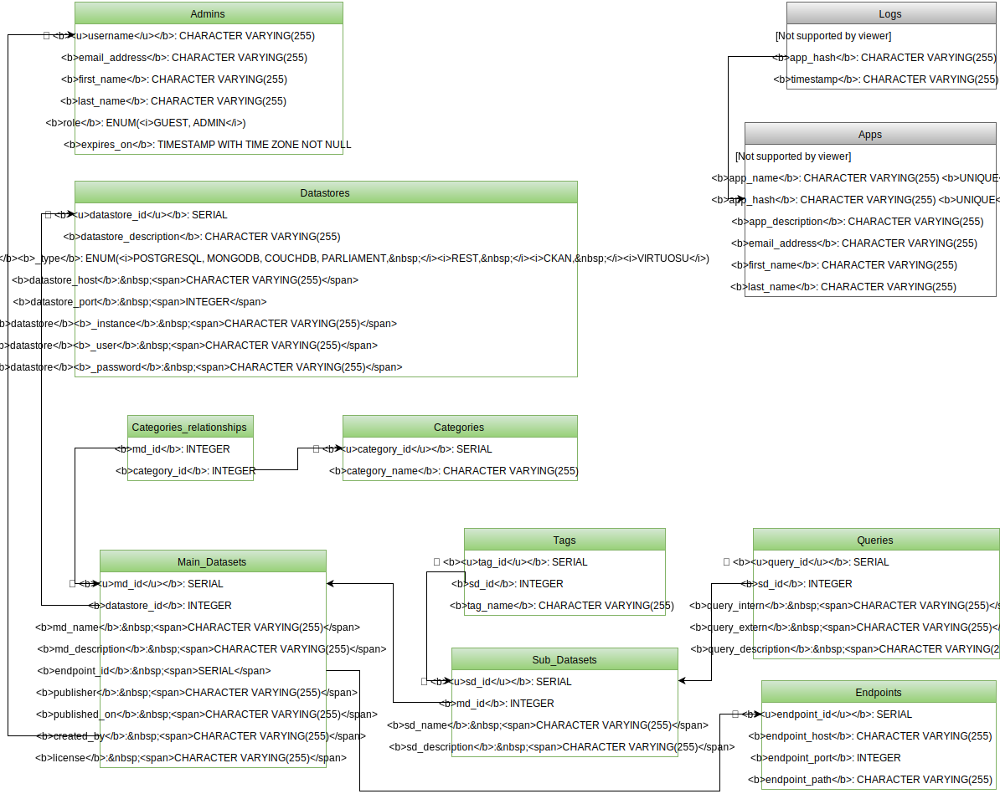

| Order | Tables |
|--|--------|
| 1 | [Apps](../schemas/1_apps) |
| 2 | [Logs](../schemas/2_logs) |
| 3 | [Admins](../schemas/3_admins) |
| 4 | [Datastores](../schemas/4_datastores) |
| 5 | [Endpoints](../schemas/5_endpoints) |
| 6 | [Main_Datasets](../schemas/6_main_datasets) |
| 7 | [Sub_Datasets](../schemas/7_sub_datasets) |
| 8 | [Tags](../schemas/8_tags) |
| 9 | [Queries](../schemas/9_queries) |
| 10 | [Parameters](../schemas/10_parameters) |

The following figure shows the database-schema:

